## 0. Instalar recursos 
Se puede instalar primero `venv`(entorno virtual) dentro de cada actividad que se realizará, así no contaminamos las demás carpetas.
0.1. `python3 -m venv venv`
* Al inicio no nos dejerá hacerlo, pues Debian/Ubuntu no tiene los paquetes necesarios (python3-venv)
0.2. `sudo apt install python3.13-venv -y`
* Ya después de poder tener los paquetes necesarios podremos usar **venv**.
* `source venv/bin/activate` es la forma para iniciar en el entorno virtual.  

Lo que si es posible es instalar **venv** para todas las carpetas que deseamos, pero en entornos reales de trabajo no es recomendable, porque se pierde la independenia.

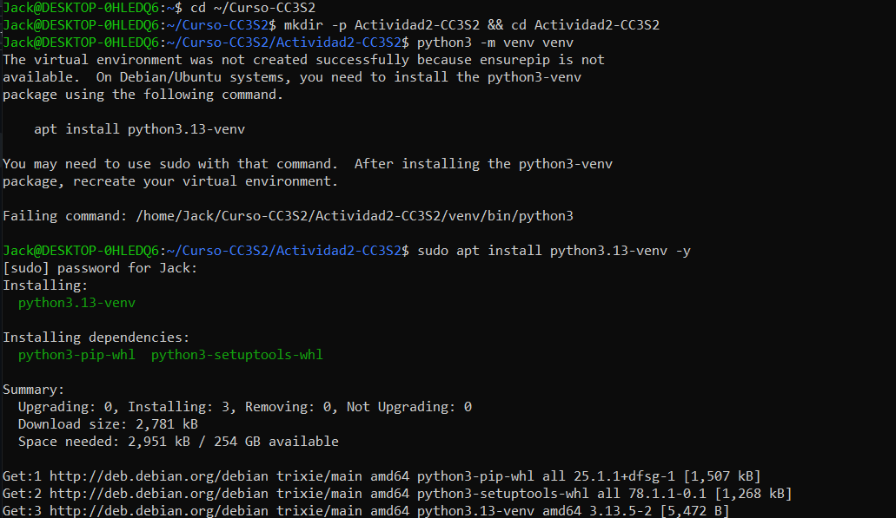

0.3. `pip install flask`, De esta forma ya también tenemos el otro recurso faltante para realizar la actividad.
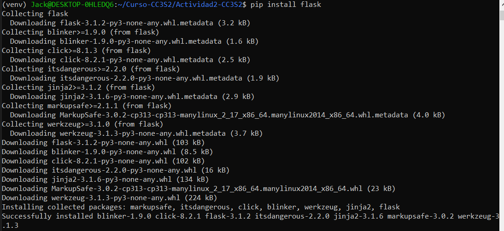

0.4 `sudo apt install dnsutils -y`, Con esto podremos podremos usar dig.
Aun que también funciona sin este paquete, modificandolo por: `getent hosts miapp.local`.

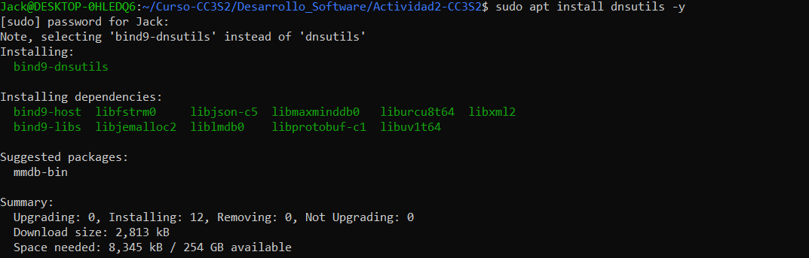

## 1. HTTP: Fundamentos y herramientas
1.1. Levanta la app 
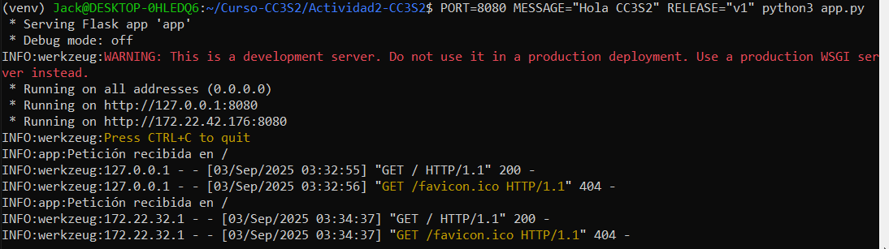
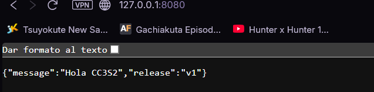

Esa salida por consola es stdout, donde: 
* `PORT=8080`: Menciona que se escuchará en el puerto 8080.
* `MESSAGE="Hola CC3S2"`: Es el mensaje que devuelva la API.

1.2. Inspección con curl
Con otra terminal de Debian.
1.2.1. Petición GET normal
   * Usando `curl -v http://127.0.0.1:8080/`
   * 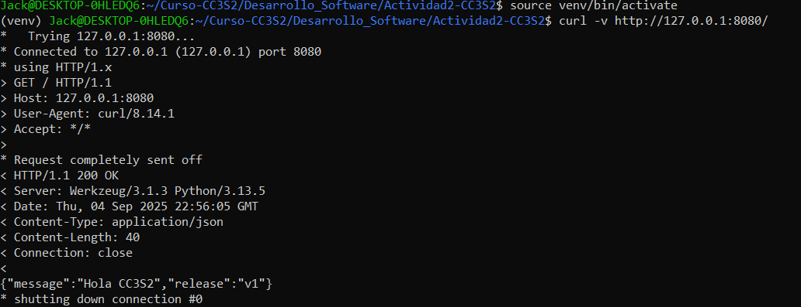
   * -v: muestra detalle de la conexión
1.2.2. Petición POST a una ruta no soportada
   * Con el comando `curl -i -X POST http://127.0.0.1:8080/`
   * 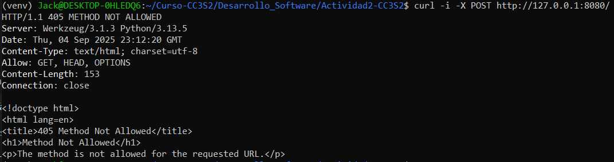
   * -i: incluye las cabeceras de respuesta.
   * Da una respuesta `HTTP/1.1 405 METHOD NOT ALLOWED` porque en el app.py solo está definida la petición GET.

1.3. Ver puertos abiertos
Como el puerto 8080 está siendo usado, lo podemos comprobar.
* `ss -ltnp | grep :8080`
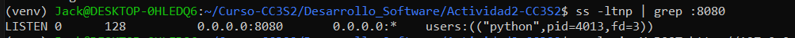

* Donde:
  * ss = herramienta para sockets
  * -l = solo sockets en escucha
  * -t = TCP
  * -n = mostrar números (no nombres de servicio)
  * -p = mostrar el proceso asociado

1.4. Logs a stdout
Cuando se ejecute peticiones con `curl`, se podrá observar líneas como:

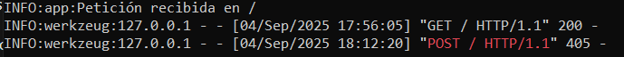
* Cumple con los principios de 12-Factor.
* Log van hacia stdout y no a los archivos locales.

## 2. DNS: nombres, registros y caché
DNS(Domain Name System): El protocolo traduce el nombre de un dominio a una dirección IP.

2.1. Host local `/etc/hosts` 
El archivo `/etc/hosts` se consulta antes que los DNS externos.

* Primero abrimos donde se ubica la carpeta.
  * `sudo nano /etc/hosts` con ello se nos aparece la interacción.
  * 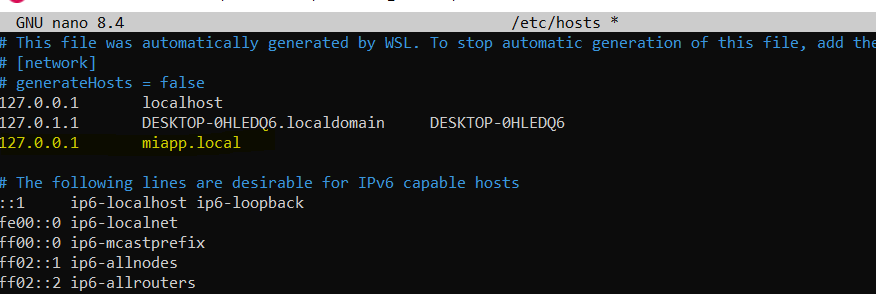

  * Lo agregado es: `127.0.0.1  miapp.local`
  * Y su funcionamiento es que cada vez escrito miapp.local se resolverá 127.0.0.1

2.2. Verificar resolución
Podemos usar la herramienta dig(Domain Information Groper) para comprobar que el nombre asignado se traduce como esperamos.
* Se puede usar tanto `dig +short miapp.local` como `getent hosts miapp.local` para obtener el resultado.
* 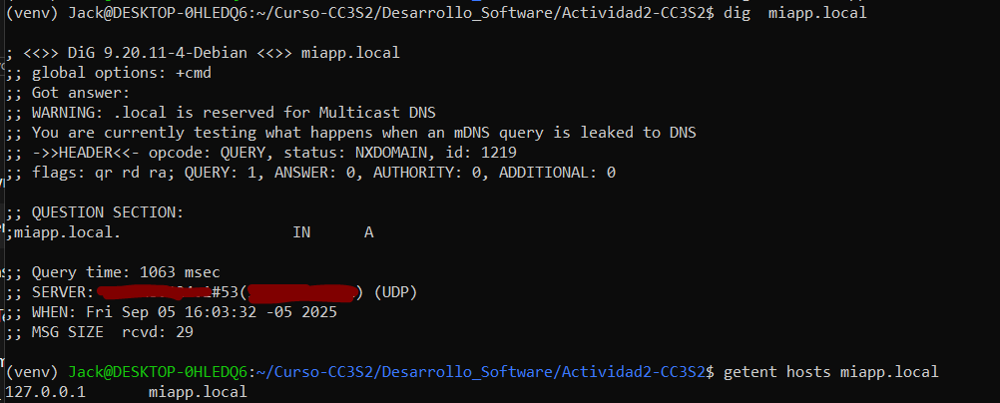
* +short es para que solo muestre el IP
* Es posible que con dig no muestre la IP. Esto pasa debido a `dig` habla directamente con un servidor DNS. Y al no tener un servidor DNS que tenga la autoridad que conozca a `miapp.local` no mostrará nada.

2.3. Observar TTL y caché
Los archivos en **/etc/hosts** no tienen TTL(tiempo de vida). 
* Por lo que para entender mejor TTL tomaremos un dominio real usando `dig example.com A +ttlunits`.
  * 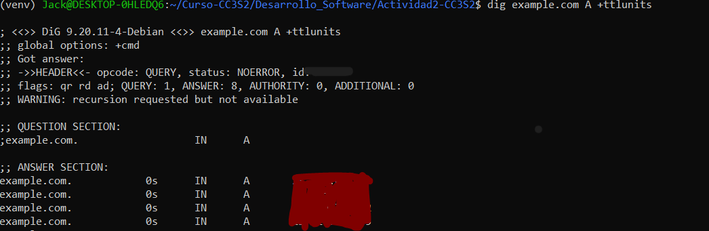
  * Con lo que podemos ver que todas los TTL muestran 0s, y eso se debe que al usar WSL en Windows lo regula para evitar conflictos.

* En cambio si usamos un "resolver público explicito" como `@1.1.1.1` o `@8.8.8.8` podremos ver los TTL reales.
  * 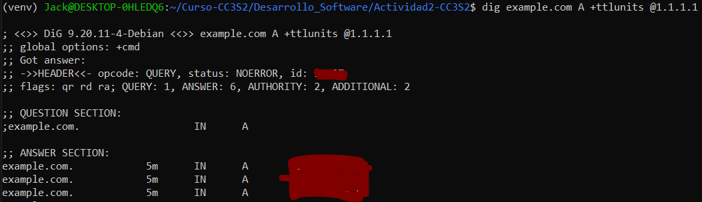

## 3. TLS con Nginx

